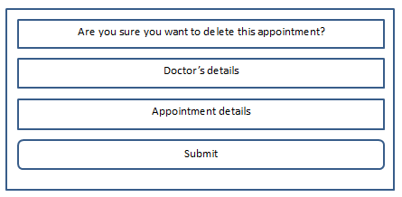
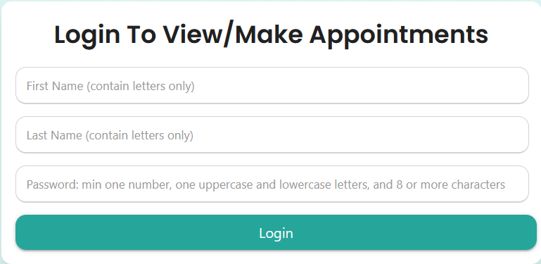
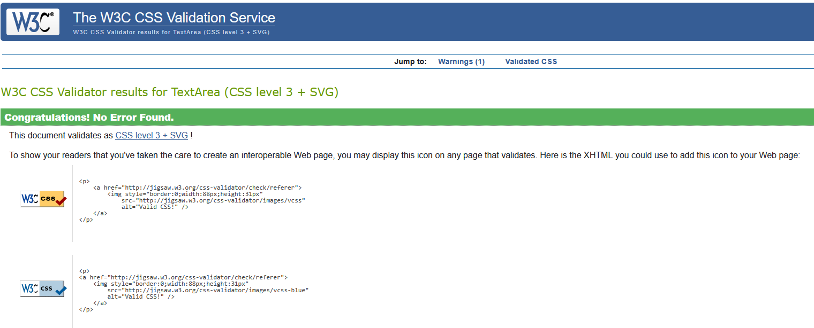

# The Community Surgery Appointment System

The community surgery is a fictitious doctors’ surgery.  The surgery is in need of an online appointment management system.
This will enable patients to manage their appointments and free up admin time for more urgent tasks.
The system should allow new patients to register and signon using an encrypted password, which will be stored on a database.
Registered patients, then, will be able to view their existing appointments, as well as updating and deleting as and when required.
A workflow has been devised to aid patients with the above tasks.  The workflow provides the surgery with the flexibility to add
extra steps as the need arises.

# Table of Contents 

* [Design](#design)

    * Technologies Used 
    * Frameworks, Libraries, Programs Used

* [User Stories](#user-stories)
  
* [Features](#features)
  
    * Current
    * Future

* [Testing](#testing)

    * HTML Validation
    * CSS Validation
    * JS Validation
    * Manual Testing
    * Functional Testing
    * Issues Encountered

* [Deployment](#deployment)

    * Github Pages
    * Local Clone

* [Credits and Acknowledgements](#credits-and-acknowledgements)

## Design

The design is to provide patients with an easy to follow system in order to view, make, update, delete appointments.
This will remove confusion and reduce the process to few simple steps.  This will also provide surgery's admin staff
with more time to spend on more critical tasks.
Design is broken into the following main sections:

- Signup
- Signon
- Home page
- Make/view appointment
- Update appointment
- Delete Appointment

### Design Wireframes

## Technologies Used

- HTML
- CSS
- Materialize
- Javascript
- JQuery
- RDBMS

## Frameworks, Libraries, Programs Used

- Github
- SQLAlchemy ORM
- Postgres
- Flask
- Fontawesome
- Google fonts
- Am I Responsive
- W3C HTML/CSS validator
- Javascript validator

## User Stories

As a new patient I’d like to be able to register easily and have a confirmation of the process's result.

A signup screen is provided for this purpose, as displayed below:

Comments are placed on each input field to indicate the required data. Fields are also marked as required, ensuring requested information 
is provided by the user. No attempts will be made at registering the user until all data is provided. 
If the user attempts to register as an existing user the following message will be displayed:

And the user will be returned to the signup screen.
A password confirmation field has been provided to ensure the user has entered the desired password.  Password is, then, encrypted and stored 
on a database.  There is, also, a field to get a list of medications the user is allergic to.
As an existing user, on signon, I’d like to be presented with a welcoming message and provided with the necessary options to view/make 
appointments.  The following screen has been provided for this purpose. Upon a successful signon, the user will be directed to the Home page 
whereby menu options are available to view/make appointments; as well as raising concerns, providing advice, using the form provided.
The signon screen is displayed below:

As with the Signup screen, above fields contain information as to the data required for each field and no attempt at signing on will be made 
until all data is provided.  Once the required user information is provided a check is made against the DB to ensure the user exist.  
If not the following message is presented:

The user, then, is directed to the Signup screen.
If incorrect information is provided, a message will inform the user and instruct a retry, as displayed below:

Upon a successful signon, the user will be presented with the following message:

And will be, subsequently, directed to the Home page, as displayed below:

On the above Home screen, a message welcomes users to the site, provides menu options to view/make appointments, as well as logging out of 
the site. Also an enquiry form is provided, enabling users to provide the practice with any concerns, advice they might have, as displayed 
below:

After filling in the form, once the send button is pressed, a message box will inform the user of the submission of the form, as displayed 
below:

Afterwards, the user will be returned to the Home page.

As a user, I’d like to be able to make appointments with doctors at the surgery on a convenient date/time.

The Appointments menu option, on the Home screen, is provided for this purpose.  A user will be able to make/view/update/delete appointments 
by clicking on Appointments menu option.  The user will be presented with below screen upon the first use:

By clicking on the button provided the user can make new appointments.  The process has been devised as a workflow, whereby the user is guided 
through a number of steps, which could be extended at a future date, if so desired.  
First the user will have to select date and time of the desired appointment, as displayed below:

Two tables, SurgeryDays & SurgeryTimes, hold data to be used to populate the dropdown fields for date and time. A script to populate the above 
table with the required date/time range is provided.  The date dropdown list will contain 10 working days’ worth of entries; meaning bookings 
could be made for up to 10 days ahead.  The times’ dropdown list allows up to four appointments per hour.
After selecting the desired date & time, the user will be presented with the following screen, whereby a doctor of choice could be selected:

Based on the selected date, doctors’ availability could be different.  This is due to an accommodation that has been made for doctors’ days 
off.  If the selected date coincides with a doctor’s day off, that doctor will be listed but will not be selectable.  A message along with the 
name of  the doctor will inform the user of this fact.
E.g. the Doctors table on the test DB currently holds the following data:

As a result an appointment date prior to March 10, 2025 should list all three doctors as available. This has been displayed in the above screenshot.
An appointment for March 10, 2025 should display one doctor as unavailable, as displayed below:

An appointment for March 11, 2025 should display two doctors as unavailable:

An appointment between March 12, 2025 and March 13, 2025 should display one doctor as unavailable:

Selecting a date after March 13, 2025 should display all doctors as available:

Two extra fields are provided on the doctor selection screen, in order to gather some information on patient’s condition and severity; as well 
as whether the patient has any special requirement; e.g. wheelchair access, lift, etc.

At the next stage, an attempt is made at making the appointment.  If the user does not have an existing appointment, for the same date/time, 
the appointment will be saved and the user is informed as such:

The user is then returned to the Appointments screen where the recent booking is displayed, as shown below:

If the user attempts to make another appointment for the same date/time combination the following message will be displayed:

And the attempt will fail.

As a user, I’d like to be able to update/delete appointments.

Each appointment is displayed as a card including two buttons enabling the user to Update/Delete existing appointments.
If the update option is selected, the following screen is displayed:

If the user chooses the Update button, again, the same process, as making a new appointment, is followed.  After selecting new date/time, or 
changing the doctor:

As noted above, appointment information has been carried on to the update screen.  Upon clicking the Next button, the user will get a message 
as to the success/failure of the process:

And the user is returned to the Appointment screen where a list of existing appointments is displayed:

If, on the other hand, the Delete button is selected for an existing appointment, the following screen is displayed to confirm user’s choice:

Upon clicking the Delete button, an attempt is made to delete the appointment and inform the user via a message screen of the outcome:

And the user is returned to the Appointment screen, where a list of all existing appointments is displayed:

As a user, I’d like to be able to logout of the system securely.

The Logout menu option, on the Home and the Appointments screens, is provided for this purpose.  Once this option is selected, user’s session 
information is deleted and the following message is displayed:

And the user is returned to the Signon screen.

## Features

### Current Features

- Password, on the Signup screen, is encrypted prior to storage on the DB.  This is then used on subsequent signons.
- A unique constraint on the patients table, made up of columns FirstName, LastName, BirthDate, prevents duplicate registration.
- Tables SurgeryDays and SurgeryTimes contain opening days/times for the surgery and is used to control date/time appointments are made for.
- Doctors table contain fields, UnavailableFrom and UnavailableTo fields, to ensure patients can make appointments with doctors on duty.
- A unique constraint on the appointments table, made up of columns PatientId, AppointmentDate, AppointmentTime, prevents a patient from making duplicate appointments.
- Menu options provided on each screen are minimal and relevant to the user activity.
- A pop-up message informs user of the result of actions taken.
- Process of making an appointment is configured as a workflow enabling users to manager their appointments easily.
- Process of making an appointment is configured as a workflow enabling the practice to include extra steps as and when required.
- The code uses try-except blocks to handle SQLAlchemyError exceptions.
- The code uses SQLAlchemy to interact with the postgres database.
- The code uses Flask's session management to store user-specific data, which is a common and recommended approach.
- Checks are carried out on input to ensure data type being entered is correct.
- Basic code deployed to prevent URL hijacking.
- Jest scripts has been used to validate HTML files.
- Pytest has been used to validate flask route nodes.

### Future Features

- Provide Admin menu to view/manage appointments.
- Provide screen to display patient information to Admin/doctors.
- Review password encryption, e.g. multifactor authentication.
- Provide password change functionality.
- Provide predefined templates for workflow modification.
- Store enquiry form on the database for future reference.

## Testing

### Issues Encountered

Most issues were due to unfamiliarity with technologies being used.  E.g. how to construct the required query/subquery in SQLAlchemy ORM.
E.g. using the following query to extract a specific record did not work:
patient = Patients.query.filter(
                    func.lower(Patients.FirstName) == fname.lower() and
                    func.lower(Patients.LastName) == lname.lower()).first()
After some testing the correct query was created:
patient = Patients.query.filter(
                    func.lower(Patients.FirstName) == fname.lower()).filter(
                    func.lower(Patients.LastName) == lname.lower()).first()
Another issue was using Flask conditional statements in templates to arrive at the desired result.  E.g. when trying to display a list of
doctors but have the ones unavailable disabled.  The issue was resolve by combining parameters passed in to the template and use of For 
loop as well as IF statements.
statement

## Deployment

Github Pages

GitHub Pages used to deploy live version of the website.
1.	Log in to GitHub and locate GitHub Repository milestone-project
2.	At the top of the Repository(not the main navigation) locate "Settings" button on the menu.
3.	Scroll down the Settings page until you locate "GitHub Pages".
4.	Under "Source", click the dropdown menu "None" and select "Main" and click "Save".
5.	The page will automatically refresh.
6.	Scroll back to locate the now-published site link in the "GitHub Pages" section.

Forking the GitHub Repository

By forking the repository, we make a copy of the original repository on our GitHub account to view and change without affecting the original repository by using these steps:
1.	Log in to GitHub and locate GitHub Repository milestone-project 
2.	At the top of the Repository(under the main navigation) locate "Fork" button.
3.	Now you should have a copy of the original repository in your GitHub account.

Local Clone

1.	Log in to GitHub and locate GitHub Repository milestone-project
2.	Under the repository name click "Clone or download"
3.	Click on the code button, select clone with HTTPS, SSH or GitHub CLI and copy the link shown.
4.	Open Git Bash
5.	Change the current working directory to the location where you want the cloned directory to be made.
6.	Type git clone and then paste The URL copied in the step 3.
7.	Press Enter and your local clone will be created.

## Credits and Acknowledgements

Thanks to my mentor, Mitko Bachvarov, for providing helpful suggestions, feedback, and links to different guides to assist with this project.
 
Thanks, also, to Miguel Ortega Logorreta, learning assistant, for the advice and guidance offered to assist with the project.
 
Code Institute for the educational materials.
 
Background medical image from pintrest.co.uk
