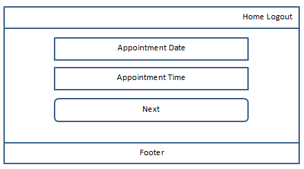

# The Community Surgery Appointment System

The community surgery is a fictitious doctors’ surgery.  The surgery is in need of an online appointment management system.
This will enable patients to manage their appointments and free up admin time for more urgent tasks.
The system should allow new patients to register and signon using an encrypted password, which will be stored on a database.
Registered patients, then, will be able to view their existing appointments, as well as updating and deleting as and when required.
A workflow has been devised to aid patients with the above tasks.  The workflow provides the surgery with the flexibility to add
extra steps as the need arises.

# Table of Contents 

* [Design](#design)

    * Technologies Used 
    * Frameworks, Libraries, Programs Used

* [User Stories](#user-stories)
  
* [Features](#features)
  
    * Current
    * Future

* [Testing](#testing)

    * HTML Validation
    * CSS Validation
    * JS Validation
    * Manual Testing
    * Functional Testing
    * Issues Encountered

* [Deployment](#deployment)

    * Github Pages
    * Local Clone

* [Credits and Acknowledgements](#credits-and-acknowledgements)

## Design Idea

The design is to provide patients with an easy to follow system in order to view, make, update, delete appointments.
This will remove confusion and reduce the process to few simple steps.  This will also provide surgery's addmin staff
with more time to spend on more critical tasks.
Design is broken into the following main sections:

-Signup 
-Signon
-Home page
-Make/view appointment
-Update appointment
-Delete Appointment

### Design Wireframes

## Technologies Used

- HTML
- CSS
- Materialize
- Javascript
- JQuery
- RDBMS

## Frameworks, Libraries, Programs Used

- Github
- SQLAlchemy
- Postgres
- Flask
- Fontawesome
- Am I Responsive
- Lighthouse
- W3C HTML/CSS validator
- W3C Markup validator
- Javascript validator
